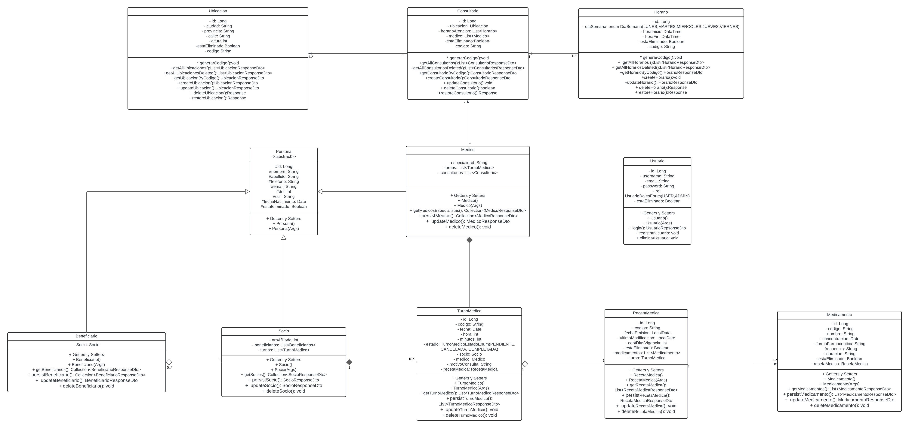
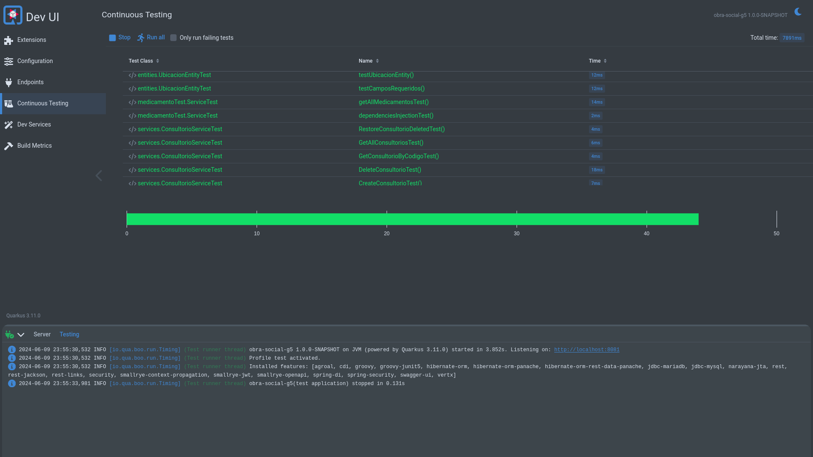

# TP-Integrador-Obra-Social
Bienvenido a la aplicación Obra Social G5, una solución integral para la gestión de servicios de obra social. Esta aplicación está diseñada para proporcionar una plataforma eficiente y fácil de usar para la administración de datos de afiliados, la gestión de prestaciones y la generación de reportes.

## Características

- **Gestión de Socios:** Registro y actualización de información de los socios y sus beneficiarios.
- **Gestión de Medicos:** Registro y actualización de información de los Medicos.
- **Gestión de Consultorios:** Registro y actualización de información de los Consultorios, ubicaciones y horarios de atención.
- **Gestión de Turnos:** Registro y actualización de información de los turnos y recetas.
- **Seguridad:** Implementación de autenticación y autorización para proteger los datos sensibles.

## UML



## Pruebas Unitarias


## Tecnologías Utilizadas

- **Backend:**
  - [Quarkus](https://quarkus.io/): Framework para Java nativo en la nube.
  - [Hibernate ORM](https://hibernate.org/orm/): Framework de mapeo objeto-relacional.
  - [MariaDB](https://mariadb.org/): Sistema de gestión de bases de datos.
- **Seguridad:**
  - [JWT (JSON Web Tokens)](https://jwt.io/): Estándar para autenticación y autorización.
- **Testing:**
  - [JUnit](https://junit.org/junit5/): Framework de pruebas unitarias para Java.
  - [Mockito](https://site.mockito.org/): Framework de simulación para pruebas unitarias.

## Requisitos Previos

- Java 17 o superior
- Maven 3.6.3 o superior
- Docker (opcional, para despliegue y base de datos)

## Instalación y Configuración

- Configurar application.properties con la base de datos que desee

### Backend

1. **Clonar el repositorio:**

   ```bash
   git clone https://github.com/Softek-UMSA-Grupo5/TP-Integrador-Obra-Social.git
   cd obra-social-g5
